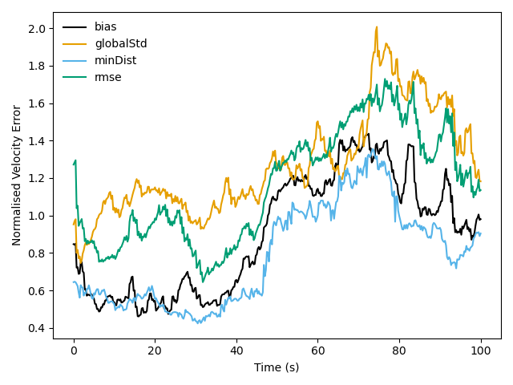
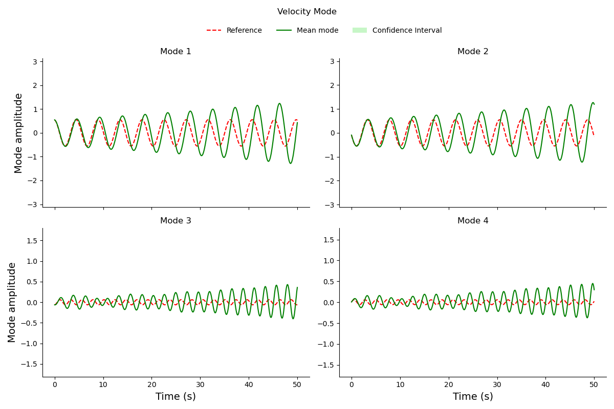

Welcome to pyRedLUM a suite of tools that allow to produce plots of the RedLUM code.

There is 2 ways of using pyRedLUM.

1. command line interface (CLI) for fast and easy plots
2. python scripts for more detailed plots (comparison between different cases)

# Installation

Required packages are the same as for pyReDA. 

You need to add the two following lines to your `.bashrc` file.

```bash
export PATH=$PATH:/path/to/pyRedA/mains
export PYTHONPATH=$PYTHONPATH:/path/to/pyReDa/functions
```

# CLI way (Fast and easy)


## Usage

The CLI version of pyRedLUM allows to generate fast and easy plots through the use of the `redlum-plot.py` script.
To do so, first go to the directory containing the result you want to plot (folder starting with "Reduced_coeff" ITHACAoutput) and then type .

```bash
redlum-plot.py [--name / -n, --verbose / -v]
```

There are two __optional__ arguments which are the following
- --name (or -n) allows to specify the name of the case, this will be used in the name of the plots generated. By default 
- --verbose (or -v) it allows to allow a certain level of verbosity in the code. If something looks weird put it to 

## Example 
Below are two example of plot produced by pyRedLUM for a run using 16 modes at Reynolds 3900.

<div style="width: 60%; height: 60%">



</div>


<div style="width: 80%; height: 80%">



</div>

# Python way (more in-depth and customable)

Use can also use the full power of pyRedLUM using you favorite IDE.  
This suite of plotting tools rely on the pyRedLUM python class which contains all the utility who know where the data is stored
and where to find configuration files. 

## Initialisation 
This is how you initialize a pyRedLUM object 
```python
from pyredlum import pyRedLUM
case = pyRedLUM(
    res_folder=working_dir, # Path of the Reduced_coeff folder
    save_dir=plotting_dir, # Where the plots are going to be stored
    name = name, # (optional) Name use when saving plots  g
    verbose=verbose # (optional) Level of verbose when running the code
)
```

This initialises `case` which is an instance of the pyRedLUM class.
`case` is then given as input to the `plot_all_modes` in `plot_modes_bp.py` for instance. This function allows to plot all the modes of a given result folder. 

## Advantage of the Python way
- Unlike the CLI version of the code, one can easily write a script that loops over a set of directory results, allowing 
to generate lots of plots without too much effort.
- One can also do a comparison of different runs (see functions like compare_sota_modes in `plot_modes_bp.py`)


## Blueprints 

`plot_bias_bp.py` and `plot_modes_bp.py` in the functions directory are 2 blueprints showing the capabilities of the pyRedLUM framework.
__I recommend you to copy these files and make your own version of it. Blueprints may evolve, have new features. 
If you modify them, it may cause conflicts when pulling new version of the code.__

